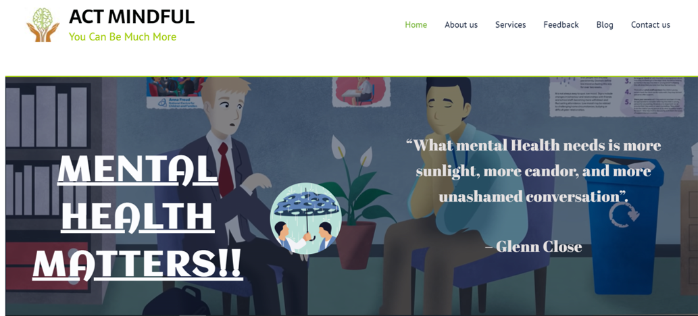

Its an implementation of a website as a solution that can provide mental health care support remotely. There are a lot of existing work in this field but also huge barriers that includes lacking access to the services, major eMH drawbacks, limited treatment, high costs etc. I used HTML, CSS and JS to design this website. Google authentication service was added to save user's time and effort. it will require just a browser making it easier to adopt than other stuff available.

The thought was to make easy access for patients through their phone at any time of the day for immediate support. this can use social media and gaming to encourage the patient to adhere to treatment, and sensors already built into the phone may be able to incorporate environment-specific cues and appropriate responses. I split the sections of our website into 6 sections: A Home page, an about us section, services, blogs, feedback and contact.

• Home page:
A welcoming page for all the users

• The About Us section:
its body of the web application for users to know more about the team and aim

• Services:
main section that will provide access to referred books, emergency contacts and address of doctors etc.

• Feedback:
Existing users can share their thoughts and opinions based on the services provided to them through an attached google form

• Blogs:
Part of the site that contains informational content about it.

• Contact:
A section that will ask users to submit their names, contact numbers and other relevant details, through which people can actually reach out to us. Other than this, a social handle of this website was made including Instagram and gmail. E-mental health applications are proliferating and hold promise to expand access to care. Identifying key gaps in our knowledge, Further discussion and research are needed on how to effectively incorporate e-mental health into service systems and to apply it to diverse populations.
